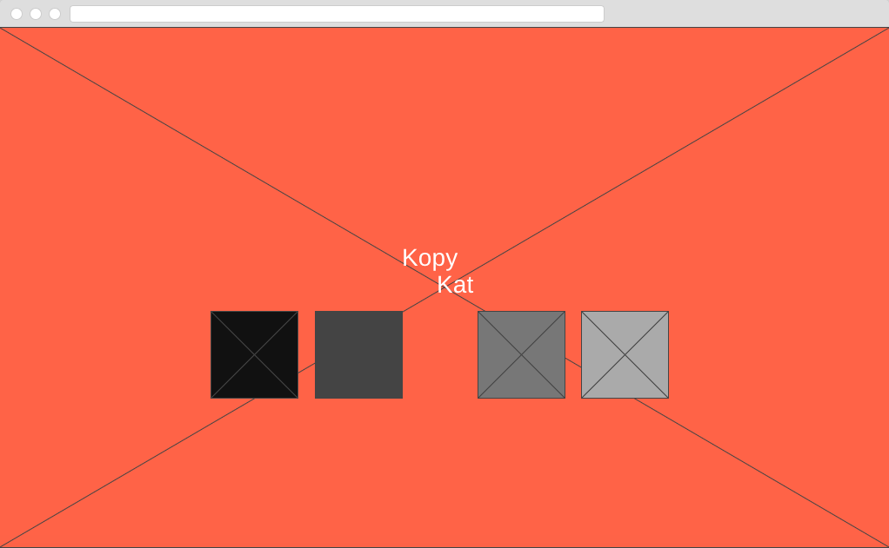
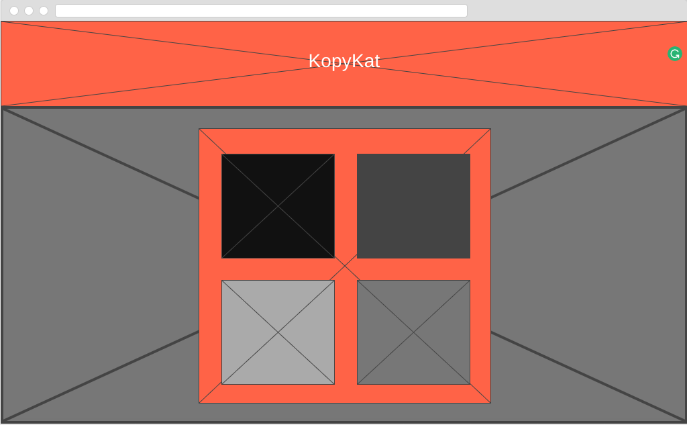

# KopyKat

## Technologies used
### HTML
Using HTML, I was able to create the foundation of the project that I would later build on using further technologies

### CSS
CSS allowed me to style my content efficiently and give the user a friendly and responsive experience

### Javascript/jQuery
Javascript and jQuery allowed me to create a dynamic project with structured logic to bring the game to life. With this technology, I created my very own rendition of the classic game Simon with multiple, user determined difficulties to challenge the user.

## Wireframes
### Homepage

### Game

## Approach
I started this project by designing minimilistic wireframes to guide myself through the beginning stages of development. Next, I created a basic layout of my game using HTML and CSS to give myself bearings while testing out my project. After this I began psuedo coding the logic of the game and started bringing the game to life. After some time, I developed a MVP for the game and used the rest of my time to add features to compliment the game, as well as styling my content along the way.

## Features
* Responsive home page
* Link to game page
* Instructions button triggers modal with clear game instructions
* No one game is the same! Sequence randomizes in real time
* Easy, Medium and Hard difficulties - User picks
* Hard mode has built in tricks to distract user
* Score tracker
* Retry button for if (when) the player loses
* Favicon! :)

## Thinking ahead
* Add different grids for different playing styles
* Add complex transitions to certain elements
* High score feature
* Two-player race mode

## Game
Experience the game here: https://moralesl5.github.io/KopyKat/